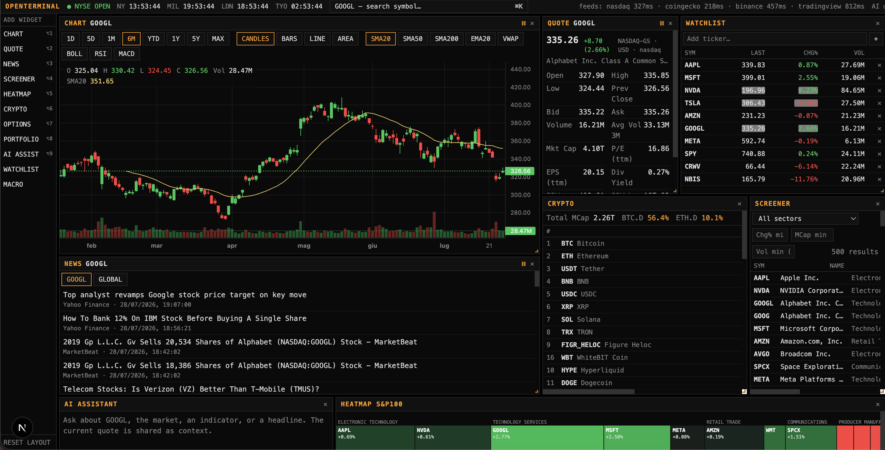
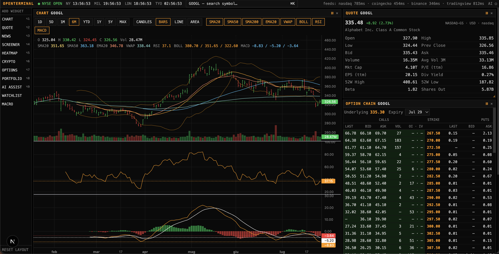
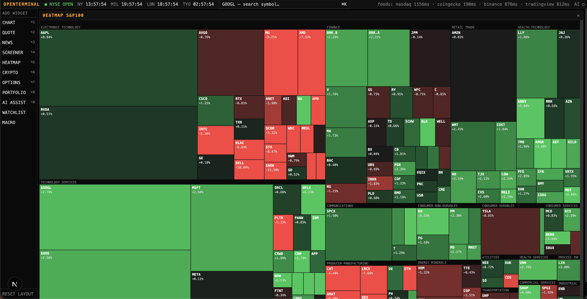
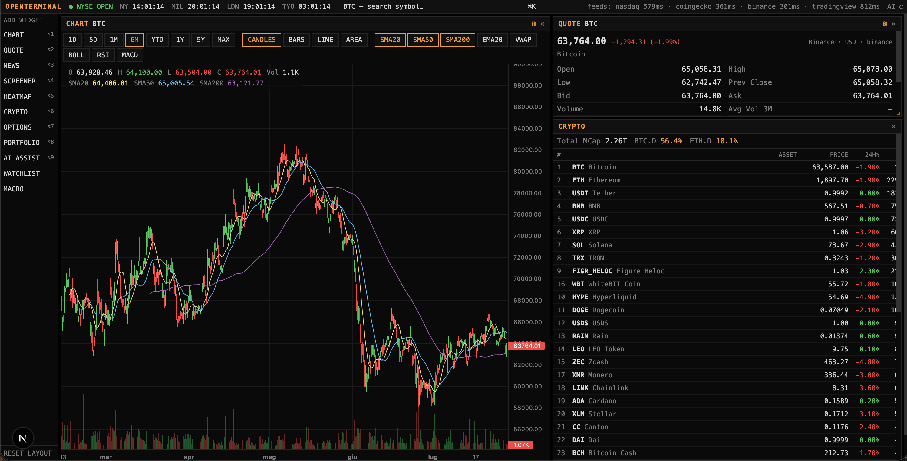
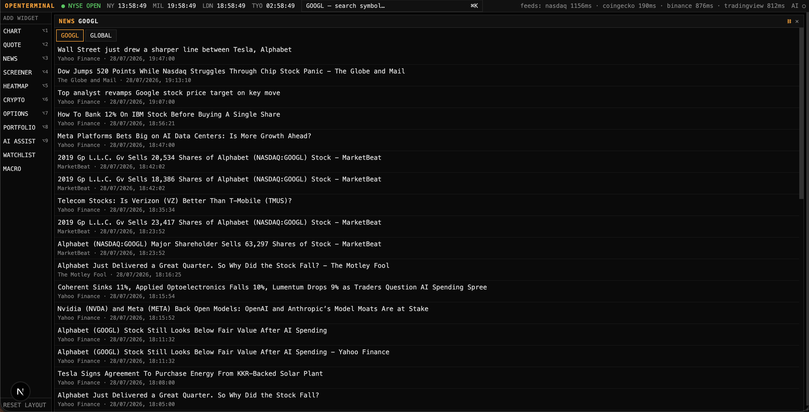

<div align="center">

# OpenTerminal

**A Terminal‑style workspace for the rest of us — built entirely on free, public market data.**

Dark. Dense. Keyboard‑driven. Zero paid API keys, zero subscriptions.

[](#tech-stack)
[](#license)
[](#data-sources)
[](#contributing)

<br/>



<sub>⭐ If this is useful to you, consider starring the repo — it genuinely helps other people find it.</sub>

</div>

<br/>

## Why OpenTerminal?

Real trading terminals cost **$2,000+ a month**. Most retail dashboards either lock the good stuff behind a paywall or run on a single flaky data source that breaks the moment you actually need it.

OpenTerminal takes a different approach: it stitches together several **free, publicly documented (or reverse‑engineered but widely used) market data endpoints** — the same ones that power major finance sites' own front ends — into one fast, keyboard‑first, widget‑based dashboard that runs entirely on your machine. Every data endpoint has an automatic fallback chain, so a single provider hiccup never takes the whole app down.

No signup. No credit card. No rate‑limited demo tier. Clone it, `npm install`, and you have a live terminal in under a minute.

<br/>

## ✨ Features

- 🖥️ **Widget-based workspace** — drag, resize, add, and remove panels (`react-grid-layout`); your layout is saved locally and restored on reload
- ⌘K **global command palette** — instantly search stocks, ETFs, and crypto and jump straight to them
- 📈 **Professional charting** (via [`lightweight-charts`](https://github.com/tradingview/lightweight-charts)) — candlesticks, bars, line, area, volume, 8 timeframes (1D → MAX), and SMA / EMA / VWAP / Bollinger Bands / RSI / MACD indicators, each with a live hover legend showing OHLC, volume, and every active indicator's value under your cursor
- 💹 **Quote panel** — last / bid / ask / OHLC, volume, market cap, P/E, EPS, dividend yield, 52‑week range, beta, shares outstanding
- 📰 **News feed** — aggregated and de‑duplicated from multiple RSS sources, per‑symbol or global
- 🔎 **Full‑market screener** — filter by sector, market cap, % change, and volume across the entire US equity market, sortable on every column
- 🗺️ **Live sector heatmap** — treemap sized by market cap, colored by daily % change, refreshing every few seconds
- ⛓️ **Options chain** — calls and puts side‑by‑side with strike, bid/ask, volume, open interest, and ITM highlighting
- 🪙 **Crypto board** — top assets with 7‑day sparklines, BTC/ETH dominance, and full OHLCV charting for any listed coin
- 🏦 **Macro dashboard** — live US Treasury yield curve, VIX, and major index/commodity proxies
- 💼 **Portfolio tracker** — log buy/sell transactions, track average cost, realized & unrealized P&L (persisted in SQLite)
- 📅 **Calendar** — economic events (Fed, ECB, CPI, NFP and more) with consensus forecast, previous reading and, for the major US/EU releases, the actual outcome; plus a per‑watchlist earnings calendar with click‑through history showing forecast vs. actual EPS for the last several quarters and the stock's next‑day price move
- 🤖 **AI assistant** (optional) — ask questions about the symbol you're looking at, powered by Claude, fully context‑aware of the terminal's current data
- ⚡ **Near real‑time updates** — quotes and indexes refresh every second with a subtle flash on change, so you always know what just moved
- ⌨️ **Keyboard shortcuts** everywhere — `⌘K` to search, `⌥1`–`⌥9` to add any widget

<br/>

## 📸 A closer look

### Charting

Candlesticks, bars, line, or area — 8 timeframes, six technical indicators, and a live legend under your cursor showing OHLC, volume, and every active indicator's value for the candle you're pointing at.



<br/>

### Live sector heatmap

The whole US equity market as a treemap — sized by market cap, colored by daily % change, refreshing every few seconds so nothing you're watching ever goes stale.



<br/>

### Crypto

Top assets with 7‑day sparklines and BTC/ETH dominance — click through to full OHLCV candlestick charting for any listed coin, same charting engine as stocks.



<br/>

### News

Headlines aggregated and de‑duplicated across multiple sources, filterable per‑symbol or global, so you're never digging through five tabs to catch up.



<br/>

## 🗂️ Data sources

No paid API, no keys, and no single point of failure — every endpoint has a fallback chain, and results are cached with a stale‑while‑revalidate strategy so a temporary outage never blanks out the UI.

| Data | Primary source | Fallback |
|---|---|---|
| Quotes (stocks/ETFs) | Nasdaq public quote API | Yahoo Finance → Stooq |
| Fundamentals (P/E, EPS, beta, div yield) | TradingView scanner API | — |
| Historical candles | Nasdaq chart API | Yahoo Finance → Stooq |
| Symbol search | TradingView symbol search | Yahoo Finance |
| Full‑market screener / heatmap | TradingView scanner API (live, whole US market) | — |
| Options chain | Nasdaq option‑chain API | Yahoo Finance |
| News | Yahoo Finance RSS | Google News RSS |
| Crypto quotes & board | CoinGecko | Binance public API |
| Crypto candles | Binance public API (klines) | — |
| Macro (Treasury yields, VIX) | FRED (Federal Reserve) | — |
| Economic calendar (schedule, forecast, previous) | Forex Factory public feed | — |
| Economic calendar (actual — Fed / ECB / CPI / NFP only) | FRED (Federal Reserve) | — |
| Earnings calendar (next/last date, EPS estimate) | TradingView scanner API | — |
| Earnings history (forecast vs. actual, surprise %) | Nasdaq earnings‑surprise API | — |

> ⚠️ These are public endpoints, not officially licensed data feeds — treat prices as delayed/indicative, not execution‑grade. See [`server/src/providers/`](server/src/providers) — each provider is a small, isolated module, so swapping or adding a data source is a 30‑minute job.

<br/>

## 🚀 Quick start

```bash
git clone https://github.com/ErTasselli/openterminal.git
cd openterminal
npm install
npm run dev
```

- Web UI → **http://localhost:3000**
- API health → **http://localhost:4000/api/status**

That's it — no `.env` file required to get a fully working terminal.

### Optional: AI assistant

```bash
export ANTHROPIC_API_KEY=sk-ant-...
npm run dev
```

Without a key, everything else still works — the AI widget just shows a friendly "unavailable" message instead of failing.

### Security defaults

- The API binds to `127.0.0.1` and only accepts browser requests from `http://localhost:3000` by default — nothing else on your network can reach it out of the box.
- The portfolio and AI endpoints require a shared secret. If you don't set `API_KEY` yourself, the API generates one on first run and saves it to `data/.api-key`; the bundled web app reads that file automatically, so local dev stays zero-config.
- To expose this beyond your own machine, set `API_HOST=0.0.0.0`, `API_KEY=<a-strong-secret>` (on both the api and web processes), and `WEB_ORIGIN=<your actual origin>` explicitly. Don't do this without also keeping dependencies patched — see [Known limitations](#known-limitations) below.

<br/>

## 🐳 Docker

```bash
docker compose up --build
```

Portfolio data persists in the `terminal-data` volume (SQLite, WAL mode). Ports are published on `127.0.0.1` only by default; see [Security defaults](#security-defaults) to expose it deliberately.

<br/>

## 🧱 Tech stack

| Layer | Stack |
|---|---|
| Frontend | Next.js 15 · React 19 · TypeScript · Tailwind CSS 4 · Zustand · TanStack Query |
| Charts | `lightweight-charts` (candles/indicators) · D3 (heatmap treemap) · Recharts (yield curve) |
| Backend | Node.js · Express · TypeScript |
| Database | SQLite (`better-sqlite3`, WAL mode) |
| AI | Anthropic Claude (optional) |

<br/>

## 📁 Project structure

```
├── server/                  # Express + TypeScript API
│   └── src/
│       ├── providers/       # nasdaq, tradingview, yahoo, stooq, fred, econcalendar, coingecko, binance, news
│       ├── routes/          # market, portfolio, ai
│       ├── cache.ts         # TTL cache with stale-while-revalidate fallback
│       └── db.ts            # SQLite (better-sqlite3, WAL)
└── web/                      # Next.js 15 + React 19 + Tailwind 4
    ├── components/           # TopBar, Sidebar, Workspace, CommandPalette
    ├── components/widgets/   # Chart, Quote, Watchlist, News, Screener, Heatmap, Crypto, Options, Macro, Portfolio, Calendar, AI
    ├── lib/                  # API client, technical indicators
    └── store/                # Zustand store (workspace layout, persisted)
```

Run tests with `npm test` (Vitest, no network calls). CI runs on every push — see [`.github/workflows/ci.yml`](.github/workflows/ci.yml).

<br/>

## 🗺️ Roadmap

- [ ] Chart drawing tools & multi‑asset comparison overlay
- [ ] Black‑Scholes Greeks on the options chain
- [ ] Price alerts with desktop notifications
- [ ] PostgreSQL as an alternative to SQLite

Have an idea? [Open an issue](../../issues) — contributions are very welcome.

<br/>

## 🤝 Contributing

Pull requests are welcome, especially:
- New or more resilient data providers (`server/src/providers/`)
- New widgets (`web/components/widgets/`)
- Bug fixes and UI polish

Please open an issue first for anything non‑trivial so we can align on approach before you invest the time.

<br/>

## Known limitations

- `npm audit` still flags two dependency advisories this project doesn't force-fix: `fast-xml-parser`'s XMLBuilder injection (moderate) doesn't apply here — only `XMLParser` is used, never `XMLBuilder` — and `postcss`'s high-severity issue is bundled inside Next.js itself, only resolved by a Next 16 major upgrade. Both are tracked, neither is silently ignored.
- If you deploy behind a reverse proxy or load balancer, set `API_HOST`/`WEB_ORIGIN` to match, and terminate TLS in front of it — this project doesn't handle HTTPS itself.

<br/>

## ⚖️ Disclaimer

For personal and educational use only. Market data comes from public endpoints and may be delayed, incomplete, or occasionally wrong — **do not use this for real investment decisions**.

This project is not affiliated with, endorsed by, or sponsored by any of the data providers it connects to. It does not host or redistribute data to third parties — it's source code you run yourself, fetching data directly from the provider. Respect the terms of service of the underlying data providers; most free sources are licensed for personal/research use only and prohibit commercial redistribution.

## License

[MIT](LICENSE)

<br/>

<div align="center">

**star the repo** ⭐ — it's the best way to support the project.

</div>
